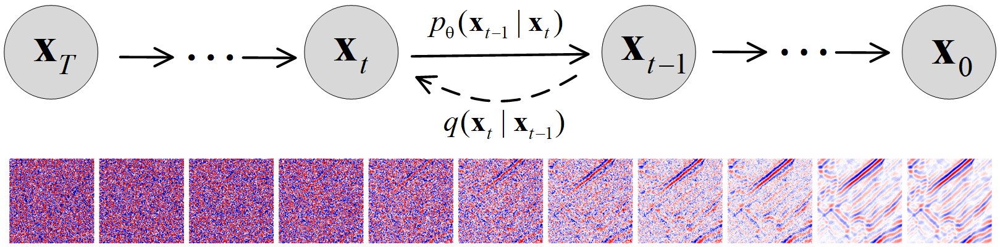
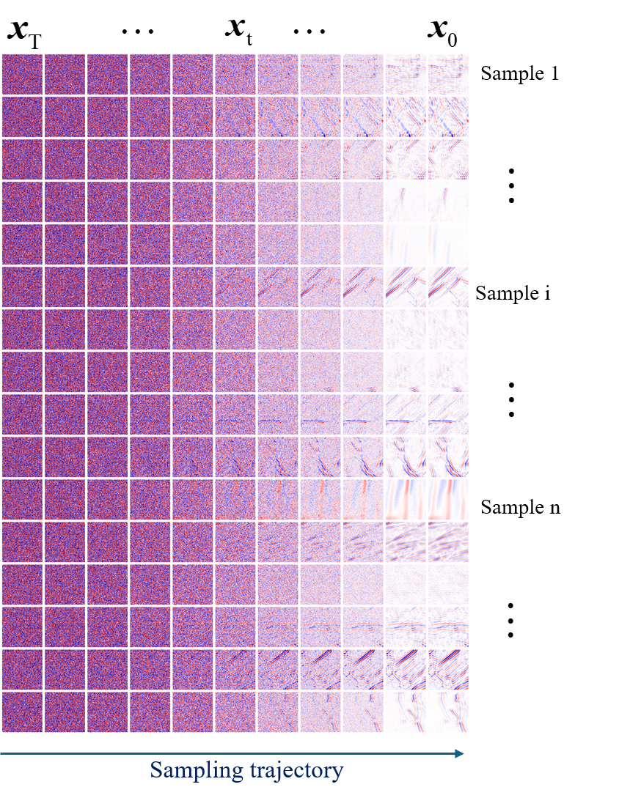

# Generative modeling of seismic data using diffusion models and its application to multi-purpose seismic inverse problems

Chuangji Meng,  Jinghuai Gao, Yajun Tian, Hongling Chen, Lin Zhou, Jie Chen, Qiu Du and Yunduo Li

Schematic diagram of BNN_LAN_DNN model and  BNNv2_LAN_DNN model




### Train a model
Training is exactly the same as DDPM with the following:
```
python main.py --config {DATASET}.yml --exp {PROJECT_PATH} --doc {MODEL_NAME} --ni
```

### Pretrained Checkpoints
We provide three trained models and log files in files `<exp>/logs/MmsSegyopenf_lin` (linear noise schedules), `<exp>/logs/MmsSegyopenf_cos` (cosine noise schedules) and `<exp>/logs/MmsSegyopenf_pow4` (power noise schedules,a=4).  see [pretrained model](通过网盘分享的文件：DDPM-seismic
链接: https://pan.baidu.com/s/13dqNc7UgtbVbDgcM-zMEVw?pwd=1111), 提取码: 1111.


### Sampling from the model

```
python main.py --config {DATASET}.yml --exp {PROJECT_PATH} --doc {MODEL_NAME} --ni
```

#### Sampling from the generalized model for FID evaluation
```
python main.py --config {DATASET}.yml --exp {PROJECT_PATH} --doc {MODEL_NAME} --sample --fid --timesteps {STEPS} --eta {ETA} --ni
```
where 
- `ETA` controls the scale of the variance (0 is DDIM, and 1 is one type of DDPM).
- `STEPS` controls how many timesteps used in the process.
- `MODEL_NAME` finds the pre-trained checkpoint according to its inferred path.

If you want to use the DDPM pretrained model:
```
python main.py --config {DATASET}.yml --exp {PROJECT_PATH} --use_pretrained --sample --fid --timesteps {STEPS} --eta {ETA} --ni
```
the `--use_pretrained` option will automatically load the model according to the dataset.


If you want to use the version with the larger variance in DDPM: use the `--sample_type ddpm_noisy` option.

## References and Acknowledgements
```
@inproceedings{meng2025generative,
  title={Generative Modeling of Seismic Data using Diffusion Models and its Application to Multi-Purpose Seismic Inverse Problems},
  author={Meng, C and Gao, J and Tian, Y and Chen, H and Zhou, L and Chen, J and Du, Q and Li, Y},
  booktitle={86th EAGE Annual Conference \& Exhibition},
  volume={2025},
  number={1},
  pages={1--5},
  year={2025},
  organization={European Association of Geoscientists \& Engineers}
}
```


This implementation is based on / inspired by:
- [DDIM](https://github.com/ermongroup/ddim)
- [ncsnv2_seismic](https://github.com/mengchuangji/ncsnv2_seismic),
- [VI-non-IID](https://github.com/mengchuangji/VI-Non-IID).
- Thanks for their contributions.

